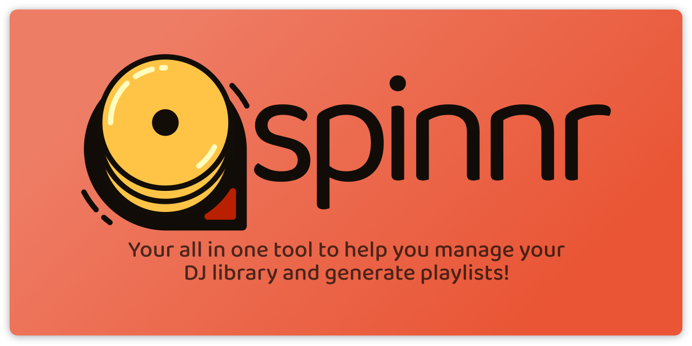

  <a href="thebrenny.github.io/spinnr"> <!-- Change the HREF to the link! -->
    
  </a>

  

    Your all in one tool to help you manage your DJ library and generate playlists!
     
    <strong><em>Powered by <a href="https://tauri.studio/">Tauri</a> and <a href="https://github.com/TheBrenny/scetch">scetch</a>!</em></strong>
	 
	Status: <em>0.0.1 (Development)</em>
  

## Table of Contents

- [Motivation](#motivation)
- [Installation](#installation)
- [Usage](#usage)
- [Advanced Usage](#advanced-usage)

## Motivation

Spinnr was made to help you manage your collection of tracks with pure ease! You probably already use Apple Music, Spotify, or other services to find new tunes, so why not just press an update button to get them all? **Spinnr can update your DJ and Spotify playslists!**

Don't you hate the lack of depth that Rekordbox's "Smart Playlists" can provide? You can only set conditions and either match all or one with no exclusions! **Spinnr can help you get the fine-tuned control you need!**

Spinnr was developed because I found that Rekordbox lacked too many features which I considered to be necessary for the current age of digital music collection and management.

## Installation

[Download the binaries](/releases)!

## Usage

> TODO: Show how to use the actual damn thing!

## Advanced Usage

> TODO: Anything pertaining to how to power use the tool and the various combinations of different things that can be done.
